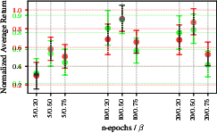
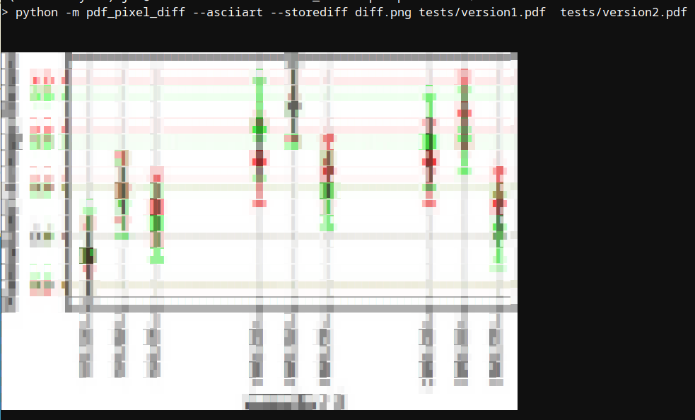

# pdf-pixel-diff

Matplotlib creates visually identical, but binary different, PDF
plots. This script compare two PDF files by converting them to an
image and performing a pixel-wise diff. As a bonus, a diff image is
created and can be shown on the console by the unicode-equivalent of
ascii art :-D

```
pipx install git+https://github.com/jkbjh/pdf-pixel-diff.git
```

Add this to your git config (e.g., `.git/config`):
```
[diff "pixelpdf"]
	binary = true
	command = sh -c 'pdf-pixel-diff --exit0 --asciiart $0 $1'
```

and in your `.gitattributes` put:
```
*.pdf	diff=pixelpdf
```

# Example

```
python -m pdf_pixel_diff --asciiart --storediff diff.png tests/version1.pdf  tests/version2.pdf
```

creates the following difference image `diff.png`:



which converted to unicode and displayed on the console looks like this:



